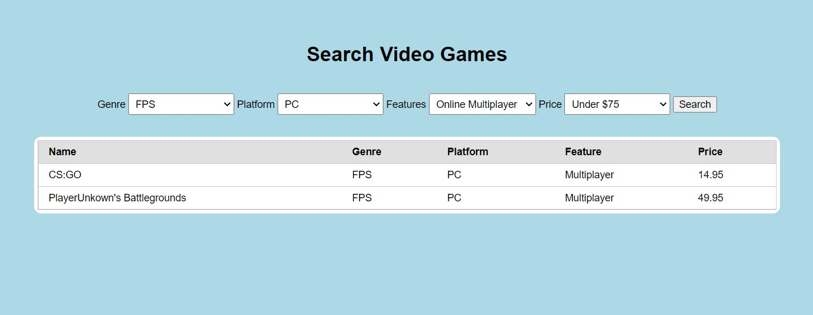

# VideoStoreSearch

Simple full stack web app implementing a search page experimenting with various filtering options to extract selected data from MySQL database. More entries may be populated for better demonstration.

Steps to run:
import the provided database.sql onto mysql into database "store_database" in mySQL
install nodejs and dependencies (express, mysql, vue)
run with $ npm start
run mysql on localhost
go to /search.html

